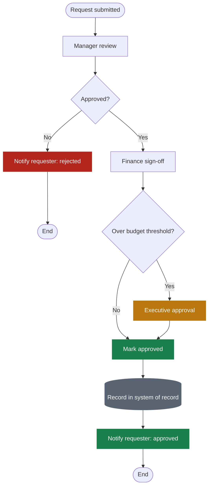

# Example: generic approval workflow

Copy this file for any "request → review → decision" process. Rename the
nodes, keep the shapes and color classes.

```mermaid
flowchart TD
    start([Request submitted]) --> review[Manager review]
    review --> decision{Approved?}
    decision -->|Yes| finance[Finance sign-off]
    decision -->|No| notifyReject[Notify requester: rejected]
    notifyReject --> endReject([End])
    finance --> decision2{Over budget threshold?}
    decision2 -->|No| approve[Mark approved]
    decision2 -->|Yes| exec[Executive approval]
    exec --> approve
    approve --> record[(Record in system of record)]
    record --> notifyApprove[Notify requester: approved]
    notifyApprove --> endApprove([End])

    classDef ok fill:#1a7f4b,color:#fff,stroke:none
    classDef warn fill:#b9770e,color:#fff,stroke:none
    classDef err fill:#b3261e,color:#fff,stroke:none
    classDef neutral fill:#5b6472,color:#fff,stroke:none

    class approve,notifyApprove ok
    class exec warn
    class notifyReject err
    class record neutral
```
