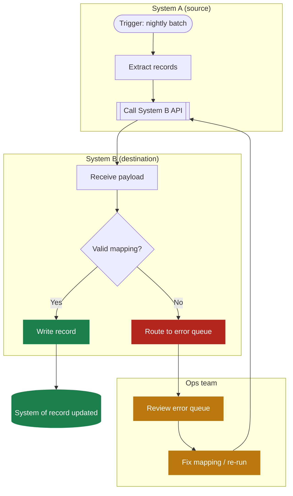
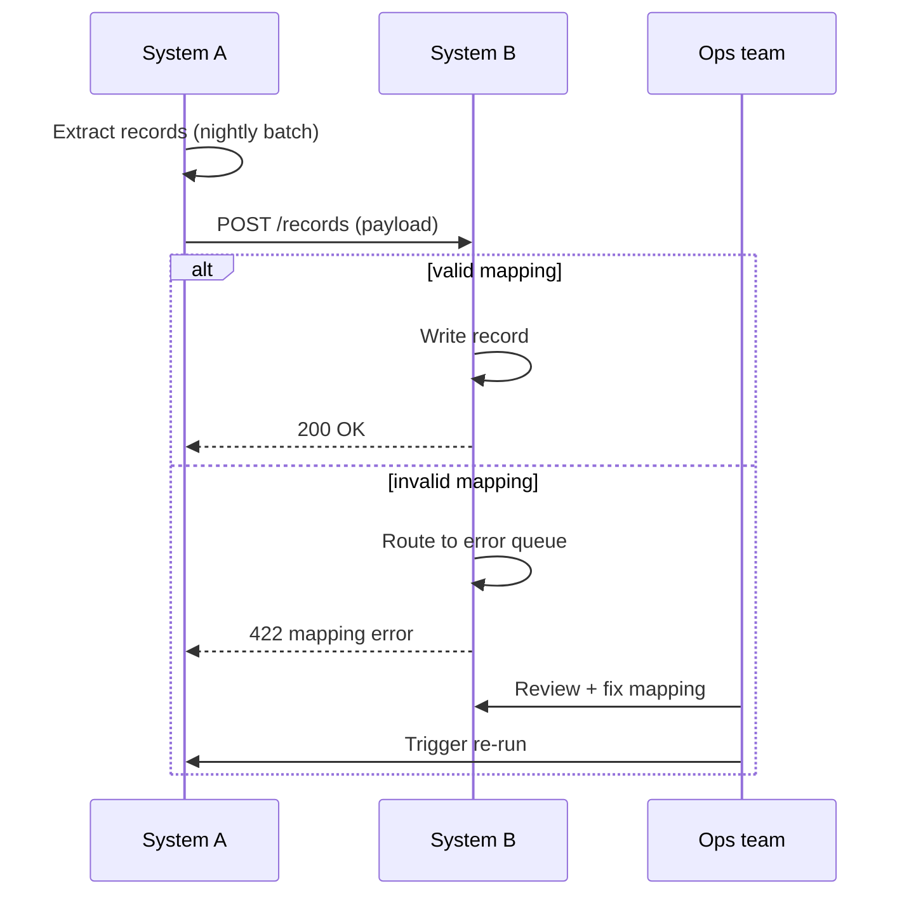

# Example: system-to-system integration flow

Copy this file for anything that crosses two or more systems — the direct
replacement for a Visio swimlane diagram. Swap the subgraph names/steps for
the real systems involved.

## When you need the call sequence instead of the swimlane view

Same integration, shown as a sequence diagram — better when the point is
*what calls what, in what order*, rather than *who owns which step*:

